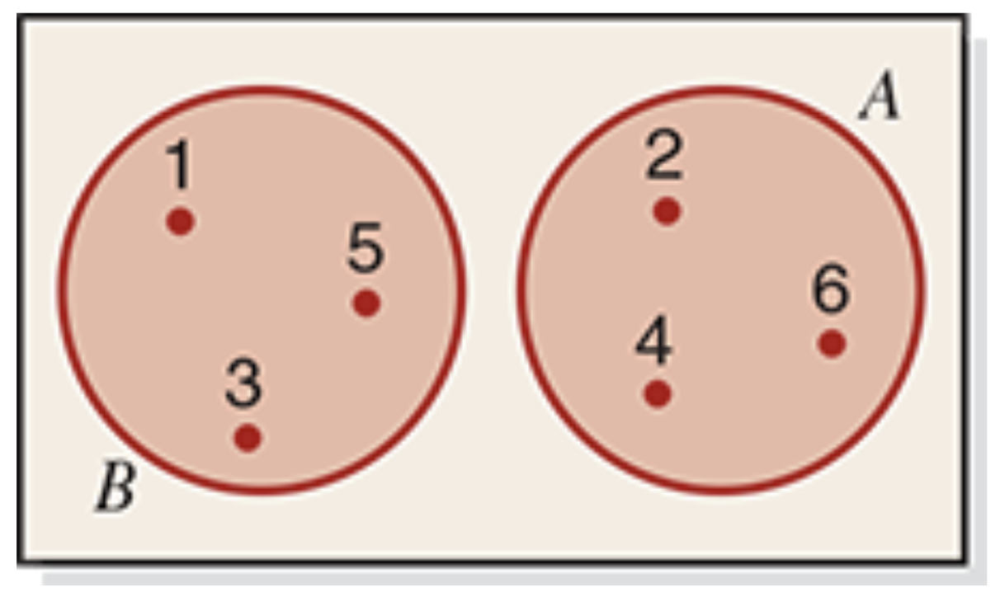
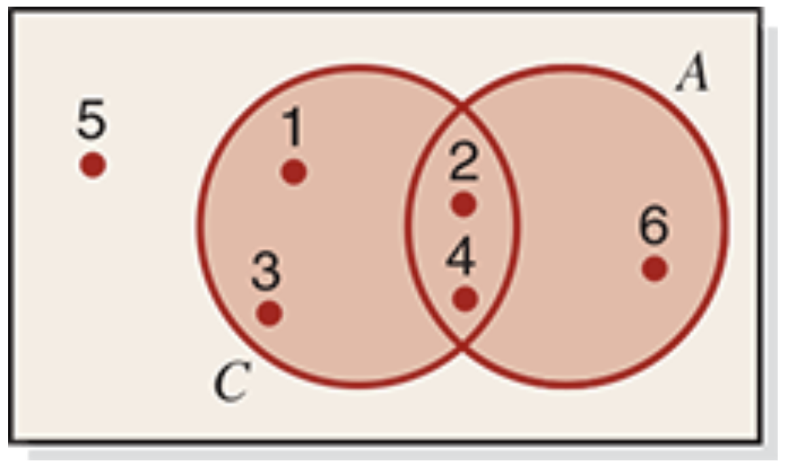
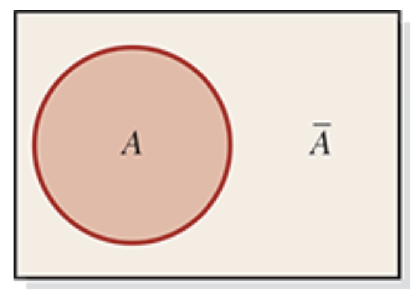
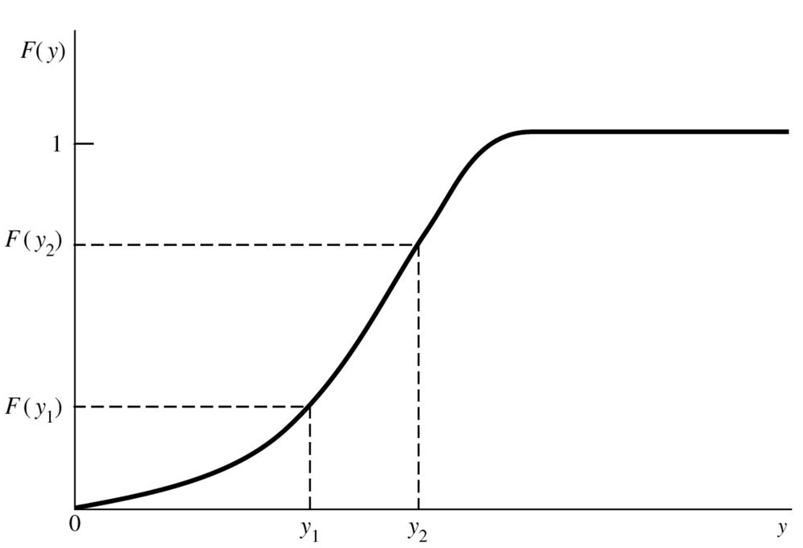
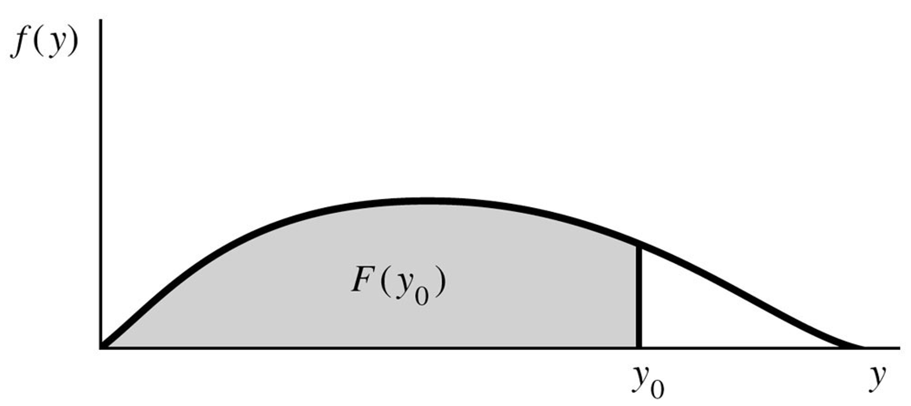
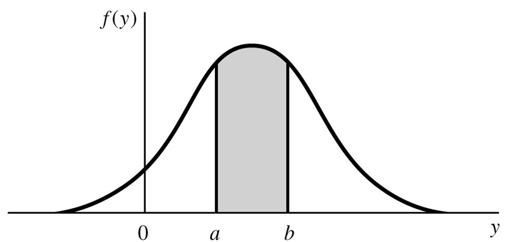
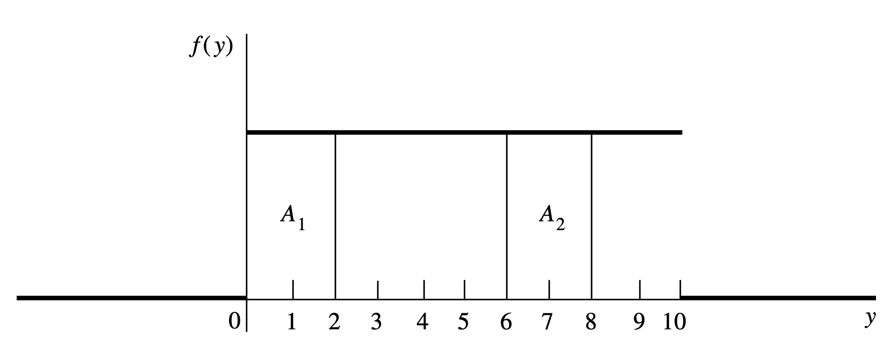
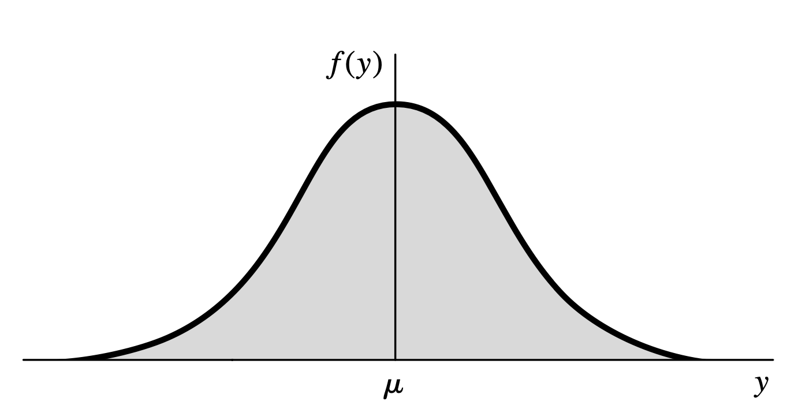
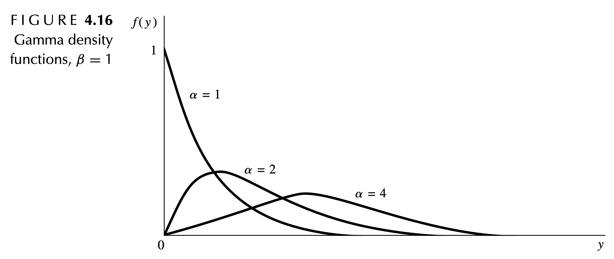
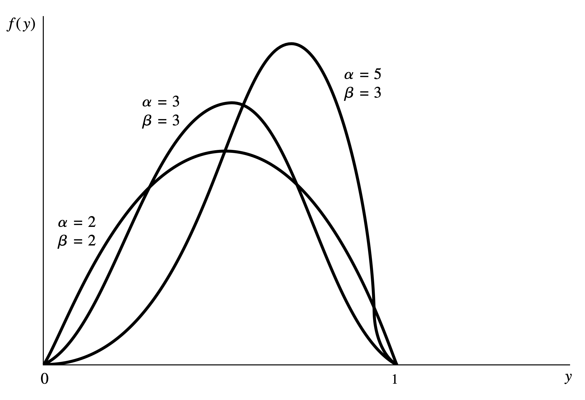

## Introduction

```{r}
#| echo: false
library(kableExtra)
library(tidyverse)
```

- Today we will review probability basics.
  - Basic terminology
  - Basic properties
  - Types of probabilities
  - Types of events
- We will also review probability distributions.
  - Binomial
  - Poisson
  - Uniform
  - Normal
  - Gamma
  - Beta

## Terminology for Probability

- <u>Experiment</u>: A process that results in one and only one of many possible observations.

- <u>Simple outcomes</u>: The possible results of our experiment.

- <u>Sample space</u>: Collection of possible outcomes of the experiment.

- <u>Event</u>: A collection of one or more of the outcomes of the experiment.

- Example: rolling a die once.

  - Outcome: the result of the die.
  - Sample space: {1, 2, 3, 4, 5, 6}
  - Events: rolling an odd; rolling a multiple of 3; rolling a 3 or better.

## Properties of Probability

- There are two properties of probability that we must keep at the forefront of our mind.

- First, probability always falls between 0 and 1. Mathematically,

$$0 \le P[E_i] \le 1$$

- What does $p=0$ imply?<br><br>
- What does $p=0.5$ imply?<br><br>
- What does $p=1$ imply?

## Properties of Probability

- There are two properties of probability that we must keep at the forefront of our mind.

- Second, the sum of all simple events for an experiment is always 1. Mathematically,

$$\sum_{i=1}^n P[E_i] = P[E_1] + ... + P[E_n] = 1$$

- If there are 2 events and we know $P[E_1]=0.7$, what is $P[E_2]$? <br><br><br>

- If there are 4 events and we know $P[E_1]=P[E_2]=0.1$, $P[E_3]=0.6$, what is $P[E_4]$?

## Assigning Probabilities

- How do we assign probabilities?
  - Subjective probability
  - Classicial probability rules
  - Relative frequency

## Subjective Probability

- Subjective probability is the probability assigned to an event based on subjective judgement, experience, information, and belief.

- Examples:

  - P\[UWF wins national championship\]
  - P\[tomato plant eaten by hornworms\]
  - P\[A in this course\]

## Classical Probability

- Let $A$ be an event for an experiment with equally likely outcomes,

$$P[A] = \frac{\text{Number of outcomes favorable to $A$}}{\text{Total number of outcomes for the experiment}}$$

- Examples:
  - P\[2 heads on 3 coin tosses\]
  - P\[at least 2 heads on 4 coin tosses\]
  - P\[even when rolling die\]

## Relative Frequency

- If an experiment is repeated $n$ times and an event $A$ is observed $f$ times, then

$$P[A] = \frac{f}{n} = \frac{\text{Frequency of $A$}}{\text{Sample size}}$$

- Example:
  - P\[car is a lemon\] given 10/500 sampled cars from a factory are lemons.
  - P\[person is a homeowner\] given 730/1000 sampled individuals own a home.

## Contingency Tables

- Suppose 100 employees at Target were asked whether they are in favor of or against extending store hours during the holiday season.

```{r}
#| echo: false
tibble(
  Department = c("Electronics","Clothing","Grocery","Customer Service","Total"),
  `In Favor` = c(12,18,25,5,60),
  Against = c(8,12,15,5,40),
  Total = c(20,30,40,10,100)
) |> kable()
```

## Marginal Probability

- A marginal probability is the probability of a single event occurring without considering any other variables.

  - In a contingency table, marginal probabilities are found outside the body of the table.

- It tells us the likelihood of one category happening overall, regardless of how it combines (or interacts) with other categories.

- In our Target example:

  - What is the probability that a randomly selected employee is in favor?
  - What is the probability that randomly selected employee works in the Grocery department?

## Marginal Probability

```{r}
#| echo: false
tibble(
  Department = c("Electronics","Clothing","Grocery","Customer Service","Total"),
  `In Favor` = c(12,18,25,5,60),
  Against = c(8,12,15,5,40),
  Total = c(20,30,40,10,100)
) |> kable()
```

- What is the probability that a randomly selected employee is in favor?

## Marginal Probability

```{r}
#| echo: false
tibble(
  Department = c("Electronics","Clothing","Grocery","Customer Service","Total"),
  `In Favor` = c(12,18,25,5,60),
  Against = c(8,12,15,5,40),
  Total = c(20,30,40,10,100)
) |> kable()
```

- What is the probability that randomly selected employee works in the Grocery department?

## Joint Probability

- **Joint probability**: the probability that two events happen at the same time.

  - In a contingency table, joint probabilities are found inside the body of the table.

- It tells us the likelihood that a randomly selected observation falls into both categories simultaneously.

- In our Target example:

  - What is the probability that an employee is in the Grocery department and in favor of extended hours?
  - What is the probability that an employee is in Electronics and against extended hours?

## Joint Probability

```{r}
#| echo: false
tibble(
  Department = c("Electronics","Clothing","Grocery","Customer Service","Total"),
  `In Favor` = c(12,18,25,5,60),
  Against = c(8,12,15,5,40),
  Total = c(20,30,40,10,100)
) |> kable()
```

- What is the probability that an employee is in the Grocery department and in favor of extended hours?

## Joint Probability

```{r}
#| echo: false
tibble(
  Department = c("Electronics","Clothing","Grocery","Customer Service","Total"),
  `In Favor` = c(12,18,25,5,60),
  Against = c(8,12,15,5,40),
  Total = c(20,30,40,10,100)
) |> kable()
```

- What is the probability that an employee is in Electronics and against extended hours?

## Conditional Probability

- **Conditional probability:** one event occurs given that we already know another event has occurred.
  - "What is the probability of Event A if we know Event B is true?"
  - In a contingency table, conditional probabilities are found by limiting yourself to a specific row or column of the table, then finding the corresponding probability.
- In our Target example,
  - What is the probability that an employee is in favor of extended hours given that they work in the Grocery department?
  - What is the probability that an employee works in the Electronics department given that they are against extended hours?

## Conditional Probability

```{r}
#| echo: false
tibble(
  Department = c("Electronics","Clothing","Grocery","Customer Service","Total"),
  `In Favor` = c(12,18,25,5,60),
  Against = c(8,12,15,5,40),
  Total = c(20,30,40,10,100)
) |> kable()
```

- What is the probability that an employee is in favor of extended hours given that they work in the Grocery department?

## Conditional Probability

```{r}
#| echo: false
tibble(
  Department = c("Electronics","Clothing","Grocery","Customer Service","Total"),
  `In Favor` = c(12,18,25,5,60),
  Against = c(8,12,15,5,40),
  Total = c(20,30,40,10,100)
) |> kable()
```

- What is the probability that an employee works in the Electronics department given that they are against extended hours?

## Mutually Exclusive Events

- Events that cannot occur together are mutually exclusive or disjoint.

- Consider rolling a single die:

  - A = an even number = {2, 4, 6}
  - B = an odd number = {1, 3, 5}
  - C = a number less than 5 = {1, 2, 3, 4}

- Are events A and B mutually exclusive?

- Are events A and C mutually exclusive?

## Mutually Exclusive Events

- Consider rolling a single die:
  - A = an even number = {2, 4, 6}
  - B = an odd number = {1, 3, 5}
  - C = a number less than 5 = {1, 2, 3, 4}
- Are events A and B mutually exclusive?

<center></center>

## Mutually Exclusive Events

- Consider rolling a single die:
  - A = an even number = {2, 4, 6}
  - B = an odd number = {1, 3, 5}
  - C = a number less than 5 = {1, 2, 3, 4}
- Are events A and C mutually exclusive?

<center></center>

## General Addition Rule

- **General Addition Rule:** For any two events, A and B,

$$P[A \cup B] = P[A] + P[B] - P[A \cap B]$$

- When events *are* mutually exclusive, $P[A \cap B] = 0$. In this case, the rule simplifies to

$$P[A] + P[B]$$

- In our Target example:
  - What is the probability that a randomly selected employee works in Grocery or is in favor of extended hours?
  - What is the probability that a randomly selected employee works in Electronics or Clothing?

## General Addition Rule

```{r}
#| echo: false
tibble(
  Department = c("Electronics","Clothing","Grocery","Customer Service","Total"),
  `In Favor` = c(12,18,25,5,60),
  Against = c(8,12,15,5,40),
  Total = c(20,30,40,10,100)
) |> kable()
```

- What is the probability that a randomly selected employee works in Grocery or is in favor of extended hours?

## General Addition Rule

```{r}
#| echo: false
tibble(
  Department = c("Electronics","Clothing","Grocery","Customer Service","Total"),
  `In Favor` = c(12,18,25,5,60),
  Against = c(8,12,15,5,40),
  Total = c(20,30,40,10,100)
) |> kable()
```

- What is the probability that a randomly selected employee works in Electronics or Clothing?

## Independent Events

- **Independent events**: the occurrence of one event does not affect the probability of the occurrence of the other event.

- Mathematically,

$$ P[A|B] = P[A] \text{ or } P[B|A] = P[B]$$

- In our Target example,
  - Is department independent of being in favor of extended hours?

## Independent Events

```{r}
#| echo: false
tibble(
  Department = c("Electronics","Clothing","Grocery","Customer Service","Total"),
  `In Favor` = c(12,18,25,5,60),
  Against = c(8,12,15,5,40),
  Total = c(20,30,40,10,100)
) |> kable()
```

- We need to examine P\[department\|favor\] or P\[favor\|department\]. We say that they are independent if
  - P\[department\|favor\] = P\[department\]
  - P\[favor\|department\] = P\[favor\]

## Complementary Events

- **Complement of A:** the event that includes all the outcomes that are not in A.

<center></center>

- Mathematically,

$$\begin{align*}
P[A] &+ P[A^c] = 1 \\
P[A] &= 1 - P[A^c] \\
P[A^c] &= 1 - P[A] 
\end{align*}$$

## Complementary Events

```{r}
#| echo: false
tibble(
  Department = c("Electronics","Clothing","Grocery","Customer Service","Total"),
  `In Favor` = c(12,18,25,5,60),
  Against = c(8,12,15,5,40),
  Total = c(20,30,40,10,100)
) |> kable()
```

- Find P\[Electronics^c^\].

## Complementary Events

```{r}
#| echo: false
tibble(
  Department = c("Electronics","Clothing","Grocery","Customer Service","Total"),
  `In Favor` = c(12,18,25,5,60),
  Against = c(8,12,15,5,40),
  Total = c(20,30,40,10,100)
) |> kable()
```

- Find P\[Electronics^c^ \| Against\].

## Bayes' Theorem

- **Bayes' Theorem:** allows us to *reverse* a conditional probability.
  - If we know $P[B|A]$, we can find $P[A|B]$.

$$P[A|B] = \frac{P[B|A] \times P[A]}{P[B]}$$

- Recall from the Conditional Probability example, we found the probability that an employee is in favor of extended hours given that they work in the Grocery department.

- To move from $P[B|A] \to P[B|A]$, we also need $P[A]$ and $P[B]$.

## Bayes' Theorem

```{r}
#| echo: false
tibble(
  Department = c("Electronics","Clothing","Grocery","Customer Service","Total"),
  `In Favor` = c(12,18,25,5,60),
  Against = c(8,12,15,5,40),
  Total = c(20,30,40,10,100)
) |> kable()
```

- Using Bayes Theorem and existing probabilities, find the probability that an employee works in the Grocery department given that they are in favor of extended hours.

## Bayes' Theorem

```{r}
#| echo: false
tibble(
  Department = c("Electronics","Clothing","Grocery","Customer Service","Total"),
  `In Favor` = c(12,18,25,5,60),
  Against = c(8,12,15,5,40),
  Total = c(20,30,40,10,100)
) |> kable()
```

- Using Bayes Theorem and existing probabilities, find the probability that an employee is against extended hours given that they work in the Electronics department.

##  {background-color="#003A6B"}

```{=html}
<div style="text-align:center; display:flex; flex-direction:column; align-items:center; justify-content:center; height:75vh; gap:1.25rem;">
  <p style="font-family:'EB Garamond',Georgia,serif; font-size:64px; font-weight:400; color:#ffffff !important; margin:0; letter-spacing:0.01em;">Take a break!</p>
  <div style="width:56px; height:3px; background:#97D200; border-radius:2px;"></div>
  <p style="font-family:'EB Garamond',Georgia,serif; font-size:36px; font-weight:300; color:#8DC8E8 !important; margin:0; font-style:italic;">Back in 10 minutes.</p>
</div>
```

## Basic Definitions

- **Discrete random variable**: a variable that can assume only a finite or countably infinite number of distinct values.

- **Probability distribution of a random variable**: collection of probabilities for each value of the random variable.

- Notation:

  - Uppercase letter (e.g., $Y$) denotes a random variable.
  - Lowercase letter (e.g., $y$) denotes a particular value that the random variable may assume.
    - The specific observed value, $y$, is not random.

## Probability Distributions for Discrete RV

- **Probability function for** $\boldsymbol Y$: sum of the the probabilities of all sample points in $S$ that are assigned the value $y$

  - $P[Y = y] = p(y)$: the probability that $Y$ takes on the value $y$.

- **Probability distribution for** $\boldsymbol Y$: a formula, table, or graph that provides $p(y) \ \forall \ y$.

- **Theorem**: For any discrete probability distribution, the following must be true:

  - $0 \le p(y) \le 1 \  \forall \ y$
  - $\sum_y p(y) = 1 \ \forall \ p(y) > 0$.

## Expected Values for Discrete RV

- **Expected value**: Let $Y$ be a discrete random variable with probability function $p(y)$. Then the *expected value* of $Y$, $E[Y]$, is defined to be

$$E(Y) = \sum_{y} y p(y)$$

- When $p(y)$ is an accurate characterization of the population frequency distribution, then the expected value is the population mean.

$$E[Y] = \mu$$

## Expected Values for Discrete RV

- **Variance**: if $Y$ is a random variable with mean $E[Y] = \mu$, the variance of a random variable $Y$ is defined to be the expected value of $(Y-\mu)^2$.

$$V[Y] = E\left[ (Y-\mu)^2 \right]$$

- If $p(y)$ is an accurate characterization of the population frequency distribution, then $V(Y)$ is the population variance,

$$V[Y] = \sigma^2$$

- **Standard deviation**: the positive square root of $V[Y]$.

## Expected Values for Discrete RV

- There is an alternative (and easier) way to calculate the variance manually,

- **Theorem**: Let $Y$ be a discrete random variable with probability function $p(y)$ and mean $E[Y] = \mu$. Then,

$$V[Y] = \sigma^2 = E\left[(Y-\mu)^2\right] = E\left[Y^2\right] - \mu^2 $$

## Expected Values for Discrete RV

- The probability distribution for a random variable $Y$ is given below.

| $y$ | $p(y)$ |
|:---:|:------:|
|  0  |  1/8   |
|  1  |  1/4   |
|  2  |  3/8   |
|  3  |  1/4   |

- Find the mean of $Y$.

## Expected Values for Discrete RV

- The probability distribution for a random variable $Y$ is given below.

| $y$ | $p(y)$ |
|:---:|:------:|
|  0  |  1/8   |
|  1  |  1/4   |
|  2  |  3/8   |
|  3  |  1/4   |

- Find the variance and standard deviation of $Y$.

## Binomial Probability Distribution

- *Binomial experiment*:

  1.  The experiment consists of a fixed number, $n$, of identical trials.

  2.  Each trial results in one of two outcomes: success ($S$) or failure ($F$).

  3.  The probability of success on a single trial is equal to some value $p$ and remains the same from trial to trial.

      - The probability of failure is equal to $q = (1-p)$.

  4.  The trials are independent.

  5.  The random variable of interest is $Y$, the number of successes observed during the $n$ trials.

## Binomial Probability Distribution

- A random variable $Y$ is said to have a *binomial distribution* based on $n$ trials with success probability $p$ [iff](https://en.wikipedia.org/wiki/If_and_only_if)

$$p(y) = {n \choose y}p^y q^{n-y}, \text{ where } y = 0, 1, 2, ..., n, \text{ and } 0 \le p \le1$$

- Let $Y$ be a binomial random variable based on n trials and success probability $p$. Then

$$E[Y] = \mu = np \ \ \ \text{and} \ \ \ V[Y] = \sigma^2 = npq$$

- See Wackerly pg. 107 for derivation.

## Binomial Probability Distribution

- We can use R to find information related to the binomial distribution.
  - $P[X = x]$: `dbinom(x, size, prob)`
  - $P[X \le x]$: `pbinom(q, size, prob)`
  - $P[X > x]$: `pbinom(q, size, prob, lower.tail = FALSE)`
- In the functions,
  - `x` or `q` is the value of $X$ we are interested in
  - `size` is the sample size ($n$)
  - `prob` is the probability of success, $\pi$
  - `lower.tail` has two options:
    - `TRUE` (default) returns $P[X \le x]$
    - `FALSE` returns $P[X > x]$

## Binomial Probability Distribution

- The manufacturer of a dairy drink wishes to compare a new formula ($B$) with that of the standard formula ($A$). Each of four judges perform a blinded taste test and report which glass he or she most enjoyed. Suppose that the two formulas are equally attractive.
  a.  What is the probability distribution? <br><br><br><br><br>
  b.  What is the mean of the distribution? <br><br><br>
  c.  What is the variance of the distribution?

## Binomial Probability Distribution

- The manufacturer of a dairy drink wishes to compare a new formula ($B$) with that of the standard formula ($A$). Each of four judges perform a blinded taste test and report which glass he or she most enjoyed. Suppose that the two formulas are equally attractive.

- Use R to find:

  a.  $P[X = 2]$
  b.  $P[X > 2]$
  c.  $P[X < 4]$

## Binomial Probability Distribution

- The manufacturer of a dairy drink wishes to compare a new formula ($B$) with that of the standard formula ($A$). Each of four judges perform a blinded taste test and report which glass he or she most enjoyed. Suppose that the two formulas are equally attractive.

- Use R to find:

  a.  $P[X = 2]$

```{r}
dbinom(x = 2, size = 4, prob = 0.5)
```

## Binomial Probability Distribution

- The manufacturer of a dairy drink wishes to compare a new formula ($B$) with that of the standard formula ($A$). Each of four judges perform a blinded taste test and report which glass he or she most enjoyed. Suppose that the two formulas are equally attractive.

- Use R to find:
  b.  $P[X > 2]$

```{r}
pbinom(q = 2, size = 4, prob = 0.5, lower.tail = FALSE)
```

## Binomial Probability Distribution

- The manufacturer of a dairy drink wishes to compare a new formula ($B$) with that of the standard formula ($A$). Each of four judges perform a blinded taste test and report which glass he or she most enjoyed. Suppose that the two formulas are equally attractive.

- Use R to find:

  c.  $P[X < 4] = P[X \le 3]$

```{r}
pbinom(q = 3, size = 4, prob = 0.5)
```

## Poisson Probability Distribution

- We often use the Poisson distribution to model count data.

- A random variable $Y$ is said to have a *Poisson probability distribution* [iff](https://en.wikipedia.org/wiki/If_and_only_if)

$$p(y) = \frac{\lambda^y}{y!}e^{-\lambda}, \text{ where } y=0,1,2,..., \text{ and } \lambda > 0$$

- If $Y$ is a random variable with a Poisson distribution with parameter $\lambda$, then

$$E[Y] = \mu = \lambda \text{ and } V[Y] = \sigma^2 = \lambda$$

- See Wackerly pg. 134 for derivation.

## Poisson Probability Distribution

- We can use R to find information related to the Poisson distribution.
  - $P[X = x]$: `dpois(x, lambda)`\
  - $P[X \le x]$: `ppois(q, lambda)`\
  - $P[X > x]$: `ppois(q, lambda, lower.tail = FALSE)`
- In the functions:
  - `x` or `q` is the value of $X$ we are interested in\
  - `lambda` is the rate of occurrence
  - `lower.tail` has two options:
    - `TRUE` (default) returns $P[X \le x]$\
    - `FALSE` returns $P[X > x]$

## Poisson Probability Distribution

- Customers arrive at a checkout counter in a department store according to a Poisson distribution at an average of seven per hour.
  a.  What is the probability distribution? <br><br><br><br><br>
  b.  What is the mean of the distribution? <br><br><br>
  c.  What is the variance of the distribution?

## Poisson Probability Distribution

- Customers arrive at a checkout counter in a department store according to a Poisson distribution at an average of seven per hour. Use R to find the following probabilities.
  a.  No more than three customers arrive.
  b.  At least two customers arrive.
  c.  Exactly five customers arrive.

## Poisson Probability Distribution

- Customers arrive at a checkout counter in a department store according to a Poisson distribution at an average of seven per hour. Use R to find the following probabilities.
  a.  No more than three customers arrive.

```{r}
ppois(q = 3, lambda = 7)
```

## Poisson Probability Distribution

- Customers arrive at a checkout counter in a department store according to a Poisson distribution at an average of seven per hour. Use R to find the following probabilities.
  b.  At least two customers arrive.

```{r}
ppois(q = 1, lambda = 7, lower.tail = FALSE)
```

## Poisson Probability Distribution

- Customers arrive at a checkout counter in a department store according to a Poisson distribution at an average of seven per hour. Use R to find the following probabilities.
  c.  Exactly five customers arrive.

```{r}
dpois(x = 5, lambda = 7)
```

## Probability Distributions for Continuous RV

- The **distribution function** of $Y$ (any random variable), denoted by $F(y)$, is such that

$$F(y) = P[Y \le y] \text{ for } -\infty < y < \infty$$

- **Theorem**: If $F(y)$ is a distribution function, then
  - $F(-\infty)   \equiv \underset{y \to -\infty}{\lim} F(y) = 0$
  - $F(\infty)    \equiv \underset{y \to \infty}{\lim} F(y) = 1$
  - $F(y)$ is a nondecreasing function of $y$.
    - If $y_1$ and $y_2$ are any values such that $y_1 < y_2$, then $F(y_1) \le F(y_2)$.

## Probability Distributions for Continuous RV

- **Continuous random variable**:
  - A random variable $Y$ with distribution function $F(y)$ is said to be *continuous* if $F(y)$ is continuous for $-\infty < y < \infty$.
- If $Y$ is a continuous random variable, then for any real number $y$, $P[Y = y] = 0$.
  - i.e., we must remember to find the probability of an interval.

{fig-align="center"}

## Probability Distributions for Continuous RV

- **Probability density function**:
  - Let $F(y)$ be the cumulative density function for a continuous random variable, $Y$. Then

$$p[Y = y] = f(y) = \frac{dF(y)}{dy} = F'(y).$$

- **Theorem**: If $f(y)$ is a density function for a continuous random variable, then
  - $f(y) \ge 0 \ \forall y, \ -\infty < y < \infty$.
  - $\int_{-\infty}^{\infty} f(y) dy = 1$.

## Probability Distributions for Continuous RV

- **Cumulative density function**:

  - Let $f(y)$ be the probability density function for a continuous random variable, $Y$. Then

$$P[Y \le y] = F(y) = \int_{-\infty}^y f(t) dt, \text{ for } y \in {\rm I\!R}.$$

{fig-align="center"}

## Probability Distributions for Continuous RV

- **Theorem:** If the random variable $Y$ has density function $f(y)$ and $a < b$, then the probability that $Y$ falls in the interval $[a, b]$ is

$$P[a \le Y \le b] = \int_a^b f(y) dy.$$

<center>{fig-align="center" width="50%"}</center>

## Expected Values for Continuous RV

- **Expected value**: The expected value of a continuous variable $Y$ is

$$E[Y] = \int_{-\infty}^{\infty} y f(y) \ dy$$

- This is the *continuous version* of the expected value for a discrete random variable,

$$E[Y] = \sum_y y p(y)$$

## Expected Values for Continuous RV

- **Theorem**: Let $g(Y)$ be a function of $Y$; then the expected value of $g(Y)$ is given by

$$E\left[ g(Y) \right] = \int_{-\infty}^{\infty} g(y) f(y) \ dy$$

- **Theorem**: Let $c$ be a constant and let $g(Y)$, $g_1(Y)$, $g_2(Y)$, ..., $g_k(Y)$ be functions of a continuous random variable, $Y$. Then the following results hold:
  - $E[c] = c$
  - $E\left[cg(Y)] = cE[g(Y)\right]$
  - $E\left[g_1(Y)+...+g_k(Y)\right] = E\left[ g_1(Y) \right] + ... + E\left[ g_k(Y) \right]$

## Uniform Probability Distribution

- **Uniform Distribution**

{fig-align="center"}

## Uniform Probability Distribution

- A random variable $Y$ is said to have a *uniform distribution* [iff](https://en.wikipedia.org/wiki/If_and_only_if)

$$f(y) = \frac{1}{\theta_2 - \theta_1}, \ \theta_1 \le y \le \theta_2$$

- If $\theta_1 < \theta_2$ and $Y$ is a uniformly distributed r.v. on the interval $(\theta_1, \theta_2)$, then

$$E[Y] = \mu = \frac{\theta_1+\theta_2}{2} \ \ \ \text{and} \ \ \ V[Y] = \sigma^2 = \frac{(\theta_2-\theta_1)^2}{12}$$

- See Wackerly pg. 176 for derivation.

## Uniform Probability Distribution

- An industrial psychologist has determined that it takes a worker between 9 and 15 minutes to complete a task on an automobile assembly line. If the time to complete the task is uniformly distributed over the interval $9 \le y \le 15$, then determine:
  a.  The probability distribution. <br><br><br><br>
  b.  The mean of the distribution. <br><br><br>
  c.  The variance and standard deviation of the distribution.

## Uniform Probability Distribution

- We can use R to find information related to the uniform distribution:
  - $P[X \le x]$: `punif(q, min, max)`\
  - $P[X \ge x]$: `punif(q, min, max, lower.tail = FALSE)`
- In the functions:
  - `q` is the value of $X$ we are interested in\
  - `min` is the lower bound of the distribution\
  - `max` is the upper bound of the distribution\
  - `lower.tail` has two options:
    - `TRUE` (default) returns $P[X \le x]$\
    - `FALSE` returns $P[X \ge x]$

## Uniform Probability Distribution

- An industrial psychologist has determined that it takes a worker between 9 and 15 minutes to complete a task on an automobile assembly line. If the time to complete the task is uniformly distributed over the interval $9 \le y \le 15$, then determine the following probabilities:
  a.  A worker takes fewer than 13 minutes.
  b.  A worker takes at least 11 minutes.
  c.  A worker takes between 14 and 15 minutes.

## Uniform Probability Distribution

- An industrial psychologist has determined that it takes a worker between 9 and 15 minutes to complete a task on an automobile assembly line. If the time to complete the task is uniformly distributed over the interval $9 \le y \le 15$, then determine the following probabilities:
  a.  A worker takes fewer than 13 minutes.

```{r}
punif(13, 9, 15)
```

## Uniform Probability Distribution

- An industrial psychologist has determined that it takes a worker between 9 and 15 minutes to complete a task on an automobile assembly line. If the time to complete the task is uniformly distributed over the interval $9 \le y \le 15$, then determine the following probabilities:
  b.  A worker takes at least 11 minutes.

```{r}
punif(11, 9, 15, lower.tail = FALSE)
```

## Uniform Probability Distribution

- An industrial psychologist has determined that it takes a worker between 9 and 15 minutes to complete a task on an automobile assembly line. If the time to complete the task is uniformly distributed over the interval $9 \le y \le 15$, then determine the following probabilities:
  c.  A worker takes between 14 and 15 minutes.

```{r}
punif(15, 9, 15) - punif(14, 9, 15)
```

## Normal Probability Distribution

- **Normal Distribution**

{fig-align="center"}

## Normal Probability Distribution

- A random variable $Y$ is said to have a *normal distribution* [iff](https://en.wikipedia.org/wiki/If_and_only_if), for $\sigma > 0$ and $-\infty < \mu < \infty$,

$$f(y) = \frac{1}{\sigma \sqrt{2\pi}} e^{-(y-\mu)^2/(2\sigma^2)}$$

- If $Y$ is a random variable normally distributed with parameters $\mu$ and $\sigma$, then

$$E[Y] = \mu  \ \ \ \text{and} \ \ \ V[Y] = \sigma^2 $$

## Normal Probability Distribution

- We can use R to find information related to the normal distribution.
  - $P[X \le x]$: `pnorm(q, mean, sd)`\
  - $P[X \ge x]$: `pnorm(q, mean, sd, lower.tail = FALSE)`
- In the functions:
  - `q` is the value of $X$ we are interested in\
  - `mean` is the population mean $\mu$\
  - `sd` is the standard deviation $\sigma$\
  - `lower.tail` has two options:
    - `TRUE` (default) returns $P[X \le x]$\
    - `FALSE` returns $P[X \ge x]$

## Normal Probability Distribution

- A random variable $Y$ is said to have a *standard normal distribution* [iff](https://en.wikipedia.org/wiki/If_and_only_if)

$$Y \sim N(\mu=0,\sigma=1)$$

- The normal distribution is then simplified to

$$f(y) = \frac{1}{\sqrt{2\pi}} e^{-y^2/2}$$

- Note that in all cases of the normal distribution, we assume $-\infty < y < \infty$.

## Normal Probability Distribution

- When using `pnorm()`, the default values for `mean` and `sd` are 0 and 1.

- Thus, if we have the standard normal our R functions simplify to:

  - $P[Z \le z]$: `pnorm(z)`\
  - $P[Z \ge z]$: `pnorm(z, lower.tail = FALSE)`

- In the functions:

  - `q` is the z-score value of interest\
  - `lower.tail = TRUE` returns $P[Z \le z]$\
  - `lower.tail = FALSE` returns $P[Z \ge z]$

## Normal Probability Distribution

- A geneticist working for a seed company develops a new carrot for growing in heavy clay soil. After measuring 5000 of these carrots, it can be said that the carrot length, $Y$, is normally distributed with $\mu = 11.5$ cm and $\sigma = 1.15$ cm. Determine
  a.  The probability distribution. <br><br><br><br>
  b.  The mean of the distribution. <br><br><br>
  c.  The variance and standard deviation of the distribution.

## Normal Probability Distribution

- A geneticist working for a seed company develops a new carrot for growing in heavy clay soil. After measuring 5000 of these carrots, it can be said that the carrot length, $Y$, is normally distributed with $\mu = 11.5$ cm and $\sigma = 1.15$ cm.
  a.  What is the probability that a carrot will be between 10 and 13 cm?
  b.  What is the probability that a carrot will be less than 9 cm?
  c.  What is the probability that a carrot will be 12 cm or larger?

## Normal Probability Distribution

- A geneticist working for a seed company develops a new carrot for growing in heavy clay soil. After measuring 5000 of these carrots, it can be said that the carrot length, $Y$, is normally distributed with $\mu = 11.5$ cm and $\sigma = 1.15$ cm.
  a.  What is the probability that a carrot will be between 10 and 13 cm?

```{r}
pnorm(q = 13, mean = 11.5, sd = 1.15) - pnorm(q = 10, mean = 11.5, sd = 1.15)
```

## Normal Probability Distribution

- A geneticist working for a seed company develops a new carrot for growing in heavy clay soil. After measuring 5000 of these carrots, it can be said that the carrot length, $Y$, is normally distributed with $\mu = 11.5$ cm and $\sigma = 1.15$ cm.
  b.  What is the probability that a carrot will be less than 9 cm?

```{r}
pnorm(q = 9, mean = 11.5, sd = 1.15)
```

## Normal Probability Distribution

- A geneticist working for a seed company develops a new carrot for growing in heavy clay soil. After measuring 5000 of these carrots, it can be said that the carrot length, $Y$, is normally distributed with $\mu = 11.5$ cm and $\sigma = 1.15$ cm.
  c.  What is the probability that a carrot will be 12 cm or larger?

```{r}
pnorm(q = 12, mean = 11.5, sd = 1.15, lower.tail = FALSE)
```

## Gamma Probability Distribution

- **Gamma Distribution**

{fig-align="center"}

## Gamma Probability Distribution

- A random variable $Y$ is said to have a *gamma distribution* with parameters $\alpha > 0$ and $\beta > 0$ [iff](https://en.wikipedia.org/wiki/If_and_only_if),

$$f(y) = \frac{y^{\alpha-1} e^{-y/\beta}}{\beta^{\alpha} \Gamma(\alpha)}, \ 0 \le y < \infty$$

- Note that $\Gamma(\alpha) = \int_{0}^{\infty} y^{\alpha-1} e^{-y} \ dy$.

- If $Y$ has a gamma distribution with parameters $\alpha$ and $\beta$, then

$$E[Y] = \mu = \alpha\beta \ \ \ \text{and} \ \ \ V[Y] = \sigma^2  = \alpha\beta^2$$

- See Wackerly pg. 187 for derivation.

## Gamma Probability Distribution

- We can use R to find information related to the Gamma distribution.
  - $P[X \le x]$: `pgamma(q, shape, rate)`\
  - $P[X \ge x]$: `pgamma(q, shape, rate, lower.tail = FALSE)`
- In the functions:
  - `q` is the value of $X$ we are interested in\
  - `shape` is the shape parameter, $\alpha$\
  - `scale` is the scale parameter, $\beta$
    - Alternatively, can parameterize with rate = $1/\beta$, `rate = 1 / scale`
  - `lower.tail` has two options:
    - `TRUE` (default) returns $P[X \le x]$\
    - `FALSE` returns $P[X \ge x]$

## Gamma Probability Distribution

- Annual incomes for heads of household in an affluent section of a city have approximately a gamma distribution with $\alpha=32$ and $\beta=2500$. Determine:
  a.  The probability distribution. <br><br><br><br>
  b.  The mean of the distribution. <br><br><br>
  c.  The variance and standard deviation of the distribution.

## Gamma Probability Distribution

- Annual incomes for heads of household in an affluent section of a city have approximately a gamma distribution with $\alpha=32$ and $\beta=2500$.
  a.  What proportion have incomes in excess of \$100,000?
  b.  What proportion have incomes between \$75,000 and \$150,000?

## Gamma Probability Distribution

- Annual incomes for heads of household in a section of a city have approximately a gamma distribution with $\alpha=32$ and $\beta=2500$.
  a.  What proportion have incomes in excess of \$30,000?

```{r}
pgamma(q = 30000, shape = 32, scale = 2500, lower.tail = FALSE)
```

## Gamma Probability Distribution

- Annual incomes for heads of household in an affluent section of a city have approximately a gamma distribution with $\alpha=32$ and $\beta=2500$.

  b.  What proportion have incomes between \$75,000 and \$150,000?\

  ```{r}
  pgamma(q = 150000, shape = 32, scale = 2500) - pgamma(q = 75000, shape = 32, scale = 2500)
  ```

## Beta Probability Distribution

- **Beta Distribution**

{fig-align="center"}

## Beta Probability Distribution

- A random variable $Y$ is said to have a *beta distribution* with parameters $\alpha > 0$ and $\beta > 0$ [iff](https://en.wikipedia.org/wiki/If_and_only_if),

$$f(y) = \frac{y^{\alpha-1}(1-y)^{\beta-1}}{B(\alpha,\beta)}, \ 0 \le y \le 1 $$

- Note: $B(\alpha,\beta) = \int_0^1 y^{\alpha-1}(1-y)^{\beta-1} \ dy = \frac{\Gamma(\alpha) \Gamma(\beta)}{\Gamma(\alpha+\beta)}.$

- If $Y$ has a beta distribution with parameters $\alpha > 0$ and $\beta > 0$, then

$$E[Y] = \mu = \frac{\alpha}{\alpha+\beta} \ \ \ \text{and} \ \ \ V[Y] = \sigma^2  = \frac{\alpha\beta}{(\alpha+\beta)^2(\alpha+\beta+1)}$$

## Beta Probability Distribution

- We can use R to find information related to the Beta distribution.
  - $P[X \le x]$: `pbeta(q, shape1, shape2)`\
  - $P[X \ge x]$: `pbeta(q, shape1, shape2, lower.tail = FALSE)`
- In the functions:
  - `q` is the value of $X$ we are interested in -- must be in \[0, 1\]!
  - `shape1` is the first shape parameter, $\alpha$\
  - `shape2` is the second shape parameter, $\beta$\
  - `lower.tail` has two options:
    - `TRUE` (default) returns $P[X \le x]$\
    - `FALSE` returns $P[X \ge x]$

## Beta Probability Distribution

- In a survey of cupcake preferences, 8 respondents liked the new cupcake flavor and 2 did not. We will model the proportion of all respondents who would like the cupcake flavor using a Beta distribution with $\alpha = 8$ and $\beta = 2$. Determine:
  a.  The probability distribution. <br><br><br><br>
  b.  The mean of the distribution. <br><br><br>
  c.  The variance and standard deviation of the distribution.

## Beta Probability Distribution

- In a survey of cupcake preferences, 8 respondents liked the new cupcake flavor and 2 did not. We will model the proportion of all respondents who would like the cupcake flavor using a Beta distribution with $\alpha = 8$ and $\beta = 2$. What is the probability that:
  a.  fewer than 60% of respondents like the new flavor?
  b.  more than 90% of respondents like the new flavor?
  c.  somewhere between 70% and 90% of respondents like the new flavor?

## Beta Probability Distribution

- In a survey of cupcake preferences, 8 respondents liked the new cupcake flavor and 2 did not. We will model the proportion of all respondents who would like the cupcake flavor using a Beta distribution with $\alpha = 8$ and $\beta = 2$. What is the probability that:
  a.  fewer than 60% of respondents like the new flavor?

```{r}
pbeta(q = 0.6, shape1 = 8, shape2 = 2)
```

## Beta Probability Distribution

- In a survey of cupcake preferences, 8 respondents liked the new cupcake flavor and 2 did not. We will model the proportion of all respondents who would like the cupcake flavor using a Beta distribution with $\alpha = 8$ and $\beta = 2$. What is the probability that:
  b.  more than 90% of respondents like the new flavor?

```{r}
pbeta(q = 0.9, shape1 = 8, shape2 = 2, lower.tail = FALSE)
```

## Beta Probability Distribution

- In a survey of cupcake preferences, 8 respondents liked the new cupcake flavor and 2 did not. We will model the proportion of all respondents who would like the cupcake flavor using a Beta distribution with $\alpha = 8$ and $\beta = 2$. What is the probability that:
  c.  somewhere between 70% and 90% of respondents like the new flavor?

```{r}
pbeta(q = 0.9, shape1 = 8, shape2 = 2) - pbeta(q = 0.7, shape1 = 8, shape2 = 2)
```

## Wrap Up

- We reviewed basic probability rules and distributions today.
  - We are setting up for our next lecture(s).
- You now are ready to work on Assignment 1: Probability Distributions.
  - .qmd file is available to download on Canvas.
  - Goals:
    - Identify the applicable distribution.
    - Find probabilities using said distributions.
- Wednesday: Thinking Like a Bayesian
