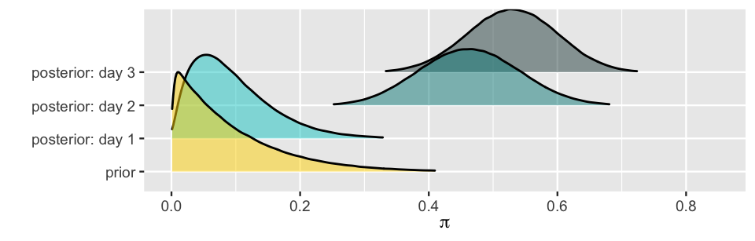
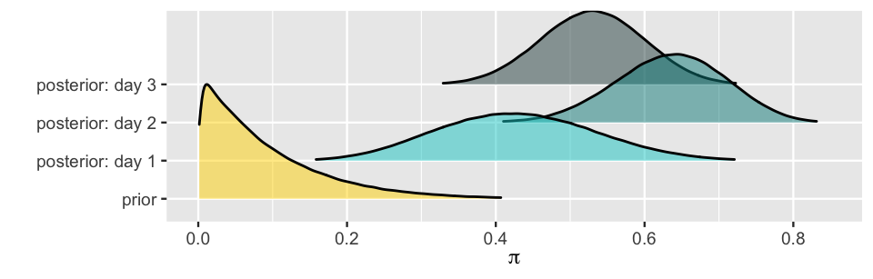

## R Packages Needed

- To follow today's lecture, please load the following packages:

```{r}
library(tidyverse)
library(bayesrules)
library(bayesplot)
library(ssstats)
library(ggpubr)
```   

## Introduction

- Last week, we learned the conjugate families.

    - Beta-Binomial
    - Gamma-Poisson
    - Normal-Normal

- Today we will discuss balance and sequentiality in Bayesian analyses.

## Introduction: Example

- In Alison Bechdel's 1985 comic strip The Rule, a character states that they only see a movie if it satisfies the following three rules (Bechdel 1986):

    - the movie has to have at least two women in it;
    - these two women talk to each other; and
    - they talk about something besides a man.

- Let  $\pi$, a random value between 0 and 1, denote the unknown proportion of recent movies that pass the Bechdel test. 

## Introduction: Example

- Three friends (feminist, clueless, and optimist) have some prior ideas about $\pi$.
    - Reflecting upon movies that he has seen in the past, the feminist understands that the majority lack strong women characters. 
    - The clueless doesn’t really recall the movies they've seen, and so are unsure whether passing the Bechdel test is common or uncommon. 
    - Lastly, the optimist thinks that the Bechdel test is a really low bar for the representation of women in film, and thus assumes almost all movies pass the test. 
    
- Graph the following priors and determine which prior belongs to each friend:

```{r}
#| eval: false
plot_beta(alpha = 1, beta = 1) + theme_minimal()
plot_beta(alpha = 5, beta = 11) + theme_minimal()
plot_beta(alpha = 14, beta = 1) + theme_minimal()
```    
    
## Example

- The clueless doesn't really recall the movies they've seen, and so are unsure whether passing the Bechdel test is common or uncommon. 

```{r}
#| echo: false
#| fig-width: 12
#| fig-height: 6.5
#| fig-align: 'center'
#| fig-alt: "Plot of priors."
plot_beta(alpha = 1, beta = 1) + theme_minimal() + ggtitle("Beta(1, 1)")
```

## Example

- Reflecting upon movies that he has seen in the past, the feminist understands that the majority lack strong women characters. 

```{r}
#| echo: false
#| fig-width: 12
#| fig-height: 6.5
#| fig-align: 'center'
#| fig-alt: "Plot of priors."
plot_beta(alpha = 5, beta = 11) + theme_minimal() + ggtitle("Beta(5, 11)")
```

## Example

- Lastly, the optimist thinks that the Bechdel test is a really low bar for the representation of women in film, and thus assumes almost all movies pass the test.

```{r}
#| echo: false
#| fig-width: 12
#| fig-height: 6.5
#| fig-align: 'center'
#| fig-alt: "Plot of priors."
plot_beta(alpha = 14, beta = 1) + theme_minimal() + ggtitle("Beta(14, 1)")
```

## Example

- The analysts agree to review a sample of $n$ recent movies and record $Y$, the number that pass the Bechdel test. 
    - Because the outcome is yes/no, the binomial distribution is appropriate for the data distribution.
    - We aren't sure what the population proportion, $\pi$, is, so we will not restrict it to a fixed value. 
        - Because we know $\pi \in [0, 1]$, the beta distribution is appropriate for the prior distribution.
    
$$
\begin{align*}
Y|\pi &\sim \text{Bin}(n, \pi) \\
\pi &\sim \text{Beta}(\alpha, \beta)
\end{align*}
$$

## Example

- Because we know $\pi \in [0, 1]$, the beta distribution is appropriate for the prior distribution.
    
$$
\begin{align*}
Y|\pi &\sim \text{Bin}(n, \pi) \\
\pi &\sim \text{Beta}(\alpha, \beta)
\end{align*}
$$

- From the previous chapter, we know that this results in the following posterior distribution

$$
\pi | (Y=y) \sim \text{Beta}(\alpha+y, \beta+n-y)
$$

    
    
## Different Priors $\to$ Different Posteriors
    
```{r}
#| echo: false
#| fig-width: 12
#| fig-height: 6.5
#| fig-align: 'center'
#| fig-alt: "Plot of priors."
ggarrange(plot_beta(alpha = 1, beta = 1) + theme_minimal() + ggtitle("Beta(1, 1)") + ylim(0,15),
          plot_beta(alpha = 5, beta = 11) + theme_minimal() + ggtitle("Beta(5, 11)") + ylim(0,15),
          plot_beta(alpha = 14, beta = 1) + theme_minimal() + ggtitle("Beta(14, 1)") + ylim(0,15),
          ncol = 3)
```

- The differing prior means show disagreement about whether $\pi$ is closer to 0 or 1.

- The differing levels of prior variability show that the analysts have different degrees of certainty in their prior information. 

    
## Different Priors $\to$ Different Posteriors

- Okay, great! We have different priors.

    - How do the different priors affect the posterior?
    
- We have data from FiveThirtyEight, reporting results of the Bechdel test.

```{r}
#| echo: false
set.seed(65821)
bechdel20 <- bayesrules::bechdel %>% sample_n(20)
head(bechdel20, n = 5)
```

## Different Priors $\to$ Different Posteriors

- How many pass the test in this sample?

```{r}
bechdel20 %>% n_pct(binary)
```


## Different Priors $\to$ Different Posteriors

- Let's look at the graphs of just the prior and likelihood.

```{r}
#| echo: false
#| fig-width: 12
#| fig-height: 6.5
#| fig-align: 'center'
#| fig-alt: "Plot of priors + likelihoods."
plot_beta_binomial(alpha = 5, beta = 11, y = 9, n = 20, posterior = FALSE) + theme_minimal() + ggtitle("The feminist: Beta(5, 11)")
```

## Different Priors $\to$ Different Posteriors

- Let's look at the graphs of just the prior and likelihood.

```{r}
#| echo: false
#| fig-width: 12
#| fig-height: 6.5
#| fig-align: 'center'
#| fig-alt: "Plot of priors + likelihoods."
plot_beta_binomial(alpha = 1, beta = 1, y = 9, n = 20, posterior = FALSE) + theme_minimal() + ggtitle("The clueless: Beta(1, 1)") 
```


## Different Priors $\to$ Different Posteriors

- Let's look at the graphs of just the prior and likelihood.

```{r, fig.align="center"}
#| echo: false
#| fig-width: 12
#| fig-height: 6.5
#| fig-align: 'center'
#| fig-alt: "Plot of priors + likelihoods."
plot_beta_binomial(alpha = 14, beta = 1, y = 9, n = 20, posterior = FALSE) + theme_minimal() + ggtitle("The optimist: Beta(14, 1)") 
```

## Different Priors $\to$ Different Posteriors

- Find the posterior distributions. (i.e., What are the updated parameters?)

<center>
<table><thead>
  <tr>
    <th>Analyst</th>
    <th>Prior</th>
    <th>Posterior</th>
  </tr></thead>
<tbody>
  <tr>
    <td>the feminist</td>
    <td>Beta(5, 11)</td>
    <td>Beta(14, 22)</td>
  </tr>
  <tr>
    <td>the clueless</td>
    <td>Beta(1, 1)</td>
    <td>Beta(10, 12)</td>
  </tr>
  <tr>
    <td>the optimist</td>
    <td>Beta(14, 1)</td>
    <td>Beta(23, 12)</td>
  </tr>
</tbody>
</table>
</center>

## Different Priors $\to$ Different Posteriors

- Let's now explore what the posteriors look like.

```{r}
#| echo: false
#| fig-width: 12
#| fig-height: 6.5
#| fig-align: 'center'
#| fig-alt: "Plot of priors, likelihoods, and posteriors."
plot_beta_binomial(alpha = 5, beta = 11, y = 9, n = 20) + theme_minimal() + ggtitle("The feminist: Beta(5, 11)")
```

## Different Priors $\to$ Different Posteriors

- Let's now explore what the posteriors look like.

```{r}
#| echo: false
#| fig-width: 12
#| fig-height: 6.5
#| fig-align: 'center'
#| fig-alt: "Plot of priors, likelihoods, and posteriors."
plot_beta_binomial(alpha = 1, beta = 1, y = 9, n = 20) + theme_minimal() + ggtitle("The clueless: Beta(1, 1)")
```

## Different Priors $\to$ Different Posteriors

- Let's now explore what the posteriors look like.

```{r}
#| echo: false
#| fig-width: 12
#| fig-height: 6.5
#| fig-align: 'center'
#| fig-alt: "Plot of priors, likelihoods, and posteriors."
plot_beta_binomial(alpha = 14, beta = 1, y = 9, n = 20) + theme_minimal() + ggtitle("The optimist: Beta(14, 1)")
```

## Different Data $\to$ Different Posteriors

- In addition to priors affecting our posterior distributions... the data also affects it.

- Let's now consider three new analysts: they all share the optimistic Beta(14, 1) for $\pi$, however, they have access to different data.
    - Morteza reviews $n = 13$ movies from the year 1991, among which  $Y=6$ (about 46%) pass the Bechdel.
    - Nadide reviews $n = 63$ movies from the year 2001, among which  $Y=29$ (about 46%) pass the Bechdel.
    - Ursula reviews $n = 99$ movies from the year 2013, among which  $Y=46$ (about 46%) pass the Bechdel.
    
- How will the different data affect the posterior distributions?

## Different Data $\to$ Different Posteriors

- How will the different data affect the posterior distributions?   

```{r}
#| echo: false
#| fig-width: 12
#| fig-height: 6.5
#| fig-align: 'center'
#| fig-alt: "Plot of priors, likelihoods, and posteriors."
plot_beta_binomial(alpha = 14, beta = 1, y = 6, n = 13) + theme_minimal() + ggtitle("Morteza: Y = 6 of n = 13")
```   

## Different Data $\to$ Different Posteriors

- How will the different data affect the posterior distributions?   

```{r}
#| echo: false
#| fig-width: 12
#| fig-height: 6.5
#| fig-align: 'center'
#| fig-alt: "Plot of priors, likelihoods, and posteriors."
plot_beta_binomial(alpha = 14, beta = 1, y = 29, n = 63) + theme_minimal() + ggtitle("Nadide: Y = 29 of n = 63")
```

## Different Data $\to$ Different Posteriors

- How will the different data affect the posterior distributions?   

```{r}
#| echo: false
#| fig-width: 12
#| fig-height: 6.5
#| fig-align: 'center'
#| fig-alt: "Plot of priors, likelihoods, and posteriors."
plot_beta_binomial(alpha = 14, beta = 1, y = 46, n = 99) + theme_minimal() + ggtitle("Ursula: Y = 46 of n = 99")
```   
    
## Different Data $\to$ Different Posteriors

- Find the posterior distributions. (i.e., What are the updated parameters?)

    - Recall that all use the Beta(14, 1) prior.    

<center>
<table><thead>
  <tr>
    <th><center>Analyst</center></th>
    <th><center>Data</center></th>
    <th><center>Posterior</center></th>
  </tr></thead>
<tbody>
  <tr>
    <td>Morteza</td>
    <td>$Y=6$ of $n=13$</td>
    <td>Beta(20, 8)</td>
  </tr>
  <tr>
    <td>Nadide</td>
    <td>$Y=29$ of $n=63$</td>
    <td>Beta(45, 35)</td>
  </tr>
  <tr>
    <td>Ursula</td>
    <td>$Y=46$ of $n=99$</td>
    <td>Beta(60, 54)</td>
  </tr>
</tbody>
</table>
</center>

## Different Data $\to$ Different Posteriors

- Let's explore what the posteriors look like.

```{r}
#| echo: false
#| fig-width: 12
#| fig-height: 6.5
#| fig-align: 'center'
#| fig-alt: "Plot of priors, likelihoods, and posteriors."
plot_beta_binomial(alpha = 14, beta = 1, y = 6, n = 13) + theme_minimal() + ggtitle("Morteza: Y = 6 of n = 13")
```

## Different Data $\to$ Different Posteriors

- Let's explore what the posteriors look like.

```{r}
#| echo: false
#| fig-width: 12
#| fig-height: 6.5
#| fig-align: 'center'
#| fig-alt: "Plot of priors, likelihoods, and posteriors."
plot_beta_binomial(alpha = 14, beta = 1, y = 29, n = 63) + theme_minimal() + ggtitle("Nadide: Y = 29 of n = 63")
```

## Different Data $\to$ Different Posteriors

- Let's explore what the posteriors look like.

```{r}
#| echo: false
#| fig-width: 12
#| fig-height: 6.5
#| fig-align: 'center'
#| fig-alt: "Plot of priors, likelihoods, and posteriors."
plot_beta_binomial(alpha = 14, beta = 1, y = 46, n = 99) + theme_minimal() + ggtitle("Ursula: Y = 46 of n = 99")
```

## Different Data $\to$ Different Posteriors

- What did we observe?
    - As $n \to \infty$, variance in the likelihood $\to 0$.
        - In Morteza's small sample of 13 movies, the likelihood function is wide.
        - In Ursula's larger sample size of 99 movies, the likelihood function is narrower.
    - We see that the narrower the likelihood, the more influence the data holds over the posterior. 

## Striking a Balance

```{r}
#| echo: false
#| fig-width: 12
#| fig-height: 6.5
#| fig-align: 'center'
#| fig-alt: "Plot of priors, likelihoods, and posteriors."
g1 <- plot_beta_binomial(alpha = 5, beta = 11, y = 9, n = 20) + theme_minimal() + ggtitle("The feminist: Beta(5, 11)")+ theme(legend.position = "none") 
g2 <- plot_beta_binomial(alpha = 1, beta = 1, y = 9, n = 20) + theme_minimal() + ggtitle("The clueless: Beta(1, 1)")+ theme(legend.position = "none") 
g3 <- plot_beta_binomial(alpha = 14, beta = 1, y = 9, n = 20) + theme_minimal() + ggtitle("The optimist: Beta(14, 1)")+ theme(legend.position = "none") 
g4 <- plot_beta_binomial(alpha = 14, beta = 1, y = 6, n = 13) + theme_minimal() + ggtitle("Morteza: Y = 6 of n = 13")+ theme(legend.position = "none") 
g5 <- plot_beta_binomial(alpha = 14, beta = 1, y = 29, n = 63) + theme_minimal() + ggtitle("Nadide: Y = 29 of n = 63")+ theme(legend.position = "none") 
g6 <- plot_beta_binomial(alpha = 14, beta = 1, y = 46, n = 99) + theme_minimal() + ggtitle("Ursula: Y = 46 of n = 99")+ theme(legend.position = "none") 
ggarrange(g1, g2, g3, g4, g5, g6, nrow=2, ncol=3)
```

- The posterior can either favor the data or the prior.
    - The rate at which the posterior balance tips in favor of the data depends upon the *prior*. 
  
## Introduction: Sequentiality

- Well, we've updated our beliefs... but now we have new data!

- The evolution in our posterior understanding happens *incrementally*, as we accumulate new data. 
    - Scientists' understanding of climate change has evolved over the span of decades as they gain new information.

    - Presidential candidates' understanding of their chances of winning an election evolve over months as new poll results become available. 
    
## Sequential Bayesian Analysis or Bayesian Learning

- In a sequential Bayesian analysis, a posterior model is updated incrementally as more data come in. 
    - With each new piece of data, the previous posterior model reflecting our understanding prior to observing this data becomes the new prior model.
    
- This is why we love Bayesian! 
    - We evolve our thinking as new data come in. 
    
- These types of sequential analyses also uphold two fundamental properties:
    1. The final posterior model is data order invariant,     
    2. The final posterior only depends upon the cumulative data.
    
## Introduction: Example

- In a 1963 issue of *The Journal of Abnormal and Social Psychology*, Stanley Milgram described a study in which he investigated the propensity of people to obey orders from authority figures, even when those orders may harm other people (Milgram 1963).

    - Let $\pi$ represent the proportion of people that will obey authority, even if it means bringing harm to others. 
    
- Prior to Milgram's experiments, our fictional psychologist expected that few people would obey authority in the face of harming another: $\pi \sim \text{Beta}(1,10)$.

## Introduction: Example

- Now, suppose that the psychologist collected the data incrementally, day by day, over a three-day period. 

- Find the following posterior distributions, each building off the last:
    - Day 0: $\text{Beta}(1,10)$.
    - Day 1: $Y=1$ out of $n=10$.
    - Day 2: $Y=17$ out of $n=20$.
    - Day 3: $Y=8$ out of $n=10$.

- Under the Beta-Binomial we know that the posterior is $\text{Beta}(\alpha + y, \beta + n - y)$.

    - Total $y=26$ and $n=40$
    - $\text{Beta}(1,10) \to \text{Beta}(27, 24)$.
    
## Sequential Bayesian Analysis or Bayesian Learning

- Finding the posterior distributions, each building off the last:

    - Day 0: $\text{Beta}(1,10)$.
    - Day 1: $Y=1$ out of $n=10$: <font color = "#cf63cd">$\text{Beta}(1,10) \to \text{Beta}(2, 19)$.</font>
    - Day 2: $Y=17$ out of $n=20$: <font color = "#cf63cd">$\text{Beta}(2, 19) \to \text{Beta}(19, 22)$.</font>
    - Day 3: $Y=8$ out of $n=10$: <font color = "#cf63cd">$\text{Beta}(19, 22) \to \text{Beta}(27, 24)$.</font> 

## Sequential Bayesian Analysis or Bayesian Learning

{fig-align="center"}

{fig-align="center"}

## Tonight: Assignment 6

- See Canvas for link to Google Doc you will edit with your team.

- In Mario Kart 8 Deluxe, mid-pack racers (positions 4-10) were tracked across the Special Cup (Cloudtop Cruise, Bone-Dry Dunes, Bowser's Castle, and Rainbow Road) because those at the front and end of the pack receive systematically different advantages. 

    - **Scenario 1:** Your group is estimating $\pi$, the probability that an item box yields a Red Shell.
    - **Scenario 2:** Your group is modelling $\lambda$, the rate of item boxes opened per minute of race time.
    - **Scenario 3:** Your group is modelling $\mu$, the average race completion time (in seconds).

## Wrap Up

- Today we have discussed balance and sequentiality.

- Remember that order of data inclusion does not matter -- we will end up with the same posterior.

- We have seen that prior specification "matters" but there will not be a large difference in the posterior distribution when priors are more similar to one another.

- Next week:
    - Regression!